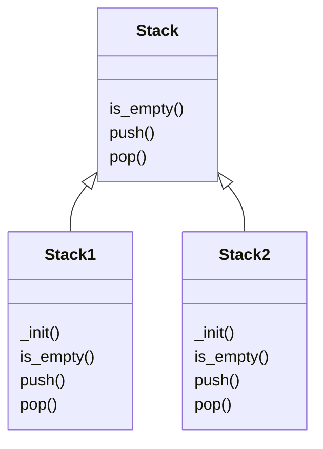

[TOC]

## 1. Working With Data

### 1.1 Introduction

- **Programming language** - a way of communicating a set of instructions to a computer.
- **program** - the <u>*text of the instructions*</u> (programming source code/ code) we wish to tell the computer to execute.

- language
  - **syntax (format)** - the rules governing what constitutes a valid program in the language
  - **semantics (meaning)** - specifies what the computer should do for each instruction

- Python **interpreter** 
  - takes programs written in the Python programming language and <u>executes</u> the instructions
  - a <u>mediator</u> between the programmer and the computer hardware

- writing code
  - write full Python programs and save them
  - run the Python interpreter in an <u>*interactive mode*</u> (**Python console/ Python shell**)
    - benefits - get quick feedback
    - drawbacks - interactions are lost every time

### 1.2 Using the Python Console

- console **prompt** `>>>`
- **expression**
  - a piece of Python code that <u>produces a value</u>
  - **evaluating** - calculating the value of an expression

- **literal**
  - the <u>simplest</u> kind of Python <u>expression</u>
  - a piece of code that represents the <u>exact value</u> as written

- **operator**
  - a <u>symbol</u> that represents a specific <u>computation</u> to perform
  - **binary** operators - used to <u>combine</u> two expressions together
- the expression `4 * 5` 
  - two smaller expressions, the literals `4` and `5`
  - operator `*`
- error message
  - something went wrong when the interpreter tried to execute the code
  - syntax error `SyntaxError`

### 1.3 Representing Data I: Numbers

- **data type**
  - allowed **values** for a piece of data of that type
  - allowed **operations** we perform on a piece of data of that type

- **abstract data types** - <u>independent</u> of programming language

- numeric data
  - natural number - $\mathbb{N} = \{0, 1, 2, ...\}$ -> **0 is a natural number**
  - integer - $\mathbb{Z} = \{...,-2,-1,0,1,2,...\}$ 
  - real number - $\mathbb{R}$
  - rational number - $\mathbb{Q} = \{\frac{p}{q} | p,q \in\mathbb{Z}\ \text{and}\ q \neq 0\}$
  - irrational number - $\overline{\mathbb{Q}} = \{x|x\in\mathbb{R}\ \text{and}\ x \notin \mathbb{Q}\}$

- data type
  - `int` - represent <u>natural numbers and integers</u>
  - `float` - represent arbitrary <u>real numbers</u>
    - <u>cannot</u> always represent exactly
    - <u>approximates</u> the value of the real number

- arithmetic operations
  - **modulo operation **`%` -  produces the <u>remainder</u>
  - power `**` 
  - **floored/ integer** division `//`
    - **rounded down** the result to the nearest integer (<u>quotient</u> of dividing $x$ by $y$) 
    - **always** get an **integer**
  - **exact** division `/` - get a **float** number (**always**)

- comparison operations
  - equality `==`
  - inequality `!=`
  - greater or equal `>=`
  - less or equal `<=`

- `int` and `float`

  - for `int`s, all operations **except** `/` always produce a `int`

    for `float`s, all operations **including** `//` always produce a `float`

    for `int` and `float`, all operations always produce a `float` 

  - different data type but equal values

    ```python
    >>> 3.0 == 3
    True
    ```

### 1.4 Representing Data II: Booleans and Strings

- **boolean** - a value from the set {True, False}
  - `bool` - only two literal values: `True`, `False`
  - operations
    - **not** - <u>reverses</u> the value of a boolean ($\neg$)
    - **and** - produces **True** when **both** of the values are **True**, and False otherwise ($\and$)
    - **or** - produces **True** when **at least one** of the values is **True**, and False otherwise ($\or$) <- inclusive or
      - **inclusive or** - produces **True** when **both** of the given boolean values are **True**
      - exclusive or - produces **False** when **both** of the given boolean values are **True**

- **string** - a sequence of characters

  - `str` - a sequence of characters surrounded by single-quotes `'`'

  - operations

    - **string equality** - use `==` 
      - uppercase and lowercase letters are <u>not equal</u>
      - exact match of all characters in both strings

    - **substring search** - `in`

      - every string is a substring of itself
      - the **empty string** is a substring of every string

      ```python
      >>> 'm' in 'computer'  # single character search
      True
      >>> 'x' in 'computer'
      False
      >>> 'put' in 'computer'  # multiple character search
      True
      >>> 'pur'  in 'computer'  # False, because characters must appear consecutively
      False
      >>> 'computer' in 'computer'  # every string is a substring of itself
      True
      >>> '' in 'computer'  # the empty string is a substring of every string
      True
      ```

    - **string concatenation** - use `+`

      ```python
      >>> 'David' + 'Mario'
      'DavidMario'
      >>> 'David ' + 'Mario'  # Extra space after David
      'David Mario'
      >>> 'Mario' + 'David '  # Order matters!
      'MarioDavid '
      ```

    - **string indexing** `s[i]`- produces the $(i+1)$-th character of a string $s$ <- index starts at **$0$**

### 1.5 Representing Data III: Collections

- **set** - a collection of zero or more <u>distinct</u> values, where <u>order does not matter</u>
  - `set` - **not duplicated** elements, **no order**
  - operations
    - **set equality** - use `== `, contain the exact <u>same</u> elements
    - **subset** - {subset}  `<=` {set}
    - **element checking** - `in`

- **list** - a sequence of zero or more values that may **contain duplicates**
  
  - `list` - may **contain duplicated** elements, a **specified order**
  - operations
    - list equality - use `==`
    - element checking - `in`
    - list concatenation - use `+`
    - list indexing - `list[i]` ($i$ starts at **0**)
  
- mapping - a collection of <u>association</u> pairs, where each pair consists of a **key** and **associated value** for that key

  - `dict` - **key** must be **unique**, a key <u>cannot</u> exist in the mapping <u>without</u> a corresponding <u>value</u>
  - operations
    - mapping equality - use `==`
    - **key checking** - `in`  <u>(WARNING: cannot check value)</u>
    - key lookup - `dict[key]`

- **homogeneous** collection - every element has the <u>same</u> type

  **heterogeneous** collection - there are elements of <u>different</u> types

- empty collection
  - list - `[]`
  - dict - `{}`
  - set - `set()`

| Abstract data type        | set                         | list                                  | mapping                                               |
| ------------------------- | --------------------------- | ------------------------------------- | ----------------------------------------------------- |
| Python data type          | `set`                       | `list`                                | `dict`                                                |
| Description               | collection of elements      | sequence of elements                  | collection of association(key-value) pairs            |
| Example                   | {1,2,3}                     | [1,2,3]                               | {1: 'one', 2:'two}                                    |
| Empty                     | `set()`                     | `[]`                                  | `{}`                                                  |
| Order matters?            | no                          | yes                                   | no                                                    |
| May contain duplicates?   | no                          | yes                                   | no duplicate keys, but possibly duplicate values      |
| Definition of homogeneous | all elements have same type | all elements have same type           | all keys have same type and all values have same type |
| Equality checking         | `==`                        | `==`                                  | `==`                                                  |
| Element checking          | `in`                        | `in`                                  | `in` (for keys only)                                  |
| Other operations          | subset checking `<=`        | concatenation `+`, indexing`...[...]` | key lookup `...[...]`                                 |

### 1.6 Variable

- **variable** - a piece of code consisting of a name that <u>refers</u> to a value

- **statement** - a piece of code <u>representing an instruction</u> to the computer

  - **expression** - <u>every expression is a statement</u>

  - **assignment statement**

    ```python
    <variable> = <expression>
    ```

    - <u>evaluated the expression</u> on the right-hand side
    - the value is <u>assigned to the variable</u> on the left-hand side

- **memory model** - a structured representation of variables and data in a program

- **value-based** memory model - represent the association between each variable and their <u>associated value</u>

  |     Variable     |   Value   |
  | :--------------: | :-------: |
  |    `distance`    | `2.34345` |
  | `total_distance` |   `10`    |

  ### 1.7 Comprehension

- **set comprehension**

  ```python
  {<expression> for <variable>} in <collection>
     {x ** 2 for x in numbers}
  == {1 ** 2, 2 ** 2, 3 ** 2, 4 ** 2, 5 ** 2}  # Replacing x with 1, 2, 3, 4, and 5.
  ```

- **list comprehension**

  ```python
  [ <expression> for <variable> in <collection> ]
  >>> [x + 4 for x in {10, 20, 30}]
  [14, 24, 34]
  >>> [x * 3 for x in [100, 200, 300]]
  [300, 600, 900]
  ```

  - when a list comprehension generates elements from a set, the results can be unexpected

    ```python
    >>> [x for x in {20, 10, 30}]
    [10, 20, 30]
    ```

- **dictionary comprehension**

  ```python
  { <key_expr>: <value_expr> for <variable> in <collection> }
  >>> {x : x ** 2 + 1 for x in {1, 2, 3, 4, 5}}
  {1: 2, 2: 5, 3: 10, 4: 17, 5: 26}
  ```

- `range(start, end)` - produce a collection of the numbers from `start` to `end-1` <- include start number but <u>exclude the end number</u>

- **Cartesian product** - $A \times B = \{(x,y)|x\in A\ \text{and}\ y\in B\}$

  - if $A = \{1,2,3\}$ and $B = \{10,20,30\}$, then $A \times B = \{(1,10),(1,20),(1,30),(2,10),(2,20),(2,30),(3,10),(3,20),(3,30)\}$

    ```python
    >>> nums1 = [1, 2, 3]
    >>> nums2 = [10, 20, 30]
    >>> [(x, y) for x in nums1 for y in nums2]
    [(1, 10), (1, 20), (1, 30), (2, 10), (2, 20), (2, 30), (3, 10), (3, 20), (3, 30)]
    ```

## 2. Function

### 2.1 Built-In Functions

- **function** - a mapping from elements in the **domain** to elements in the **codomain**

- function call

  - **argument** - input expressions
  - arguments are <u>passed</u> to the function when evaluating a function call
  - a function call <u>returns</u> the value when producing its output value

  ```python
  <function>(<argument>, <argument>, ...)
  ```

- built-in functions

  - `abs(x)` - returns the absolute value

  - `round(x)` - returns the `int` that equals `x` rounded to the nearest integer

  - `round(x,d)` - returns the `float` value of `x` rounded to `d` decimal places

  - `len(x)` - returns the size of its input

  - `sum(x)` - takes a <u>collection</u> of numbers and returns the sum of the numbers

  - `sorted(x)` - takes a <u>collection</u> and returns a sorted `list` (default ascending order)

  - `type` - returns its data type

  - `help` - displays help documentation for the argument

  - `max` (similar `min`)

    - two or more inputs - inputs must be numeric, returns the largest one

    - a single argument - a non-empty collection of numbers, returns the largest number in the collection

      ```python
      >>> max(2, 3)
      3
      >>> max({2, 3})
      3
      ```

### 2.2 Define Function

- function **header**

  - function's **name**

  - the number and type of **parameters**

  - function's **return type**

  - **type contract** - restriction of types

    ```python
    def <function_name>(<parameter_name>: <parameter_type>) -> <return_type>:
        
    #multiple parameter
    def <function_name>(<para1_name>: <para1_type>, ><para2_name>: <para2_type>...) -> <return_type>:
    ```

- function **docstring **- communicate what the function does
  - start and end with `"""`
  - function description
  - doctest examples

- function body - the code that is executed

  - can <u>call another function</u> inside the function body

  - return statement

    ```python
    return <expression>
    ```

- function call
  - evaluate the argument, <u>assign</u> its value to the function <u>parameter</u>
  - evaluate the function body, stop and return

```python
def my_function (para_1: type_1, para_2: type_2) -> return_type
	# docstring begin
    """	
	This function does ...	# function description
	>>> my_function(x, y)	# doctest example
	...
	"""	
    # doctring end
    
    <statement>	# function body
    return ...	#return statement
```

### 2.3 Local Variables & Function Scope

- **local variable** - limited to the **function body** (<u>scope: function body</u>)
  - can **only** be accessed in the function body it is **defined**
- scope - the places where that variable can be accessed

- allow using the **same** variable name in two different scopes (**different functions**)

### 2.4 Methods

- function
  - **method** - a function that is defined as part of a <u>data type</u>
  - top-level functions - functions are not methods

- string method
  - `str.lower()` - returning a new string uppercase turned into lowercase
  - `str.split()` - splits a string into words contained in a <u>list</u>

- set method
  - `set.union()` - return the new set $C = A \cup B$
  - `set.intersection()` - return a new set $C = A \cap B$

- list method
  - `list.count()` - returns the number of times that value appears in the list

### 2.5 Modules

- modules - <u>not automatically loaded</u> Python code files

  - use **import statement** to load

    ```python
    import <module_name>
    ```

  - use `dir` to see a list of functions and variables defined in the module

- `datetime` module

  - `datetime.date` - new data types for <u>representing time-based</u> data

  - `datetime.date()` - create a new date

  - `datetime.date.weekday()` - return the day of the week of the date (0 = Monday)

  - `datetime.timedelta` - data type

    - instance `days` represent an interval of time

  - use `==`, `<`, ... to compare date

    ```python
    >>> import datetime
    >>> canada_day = datetime.date(1867, 7, 1)
    >>> david_fake_birthday = datetime.date(2000, 3, 22)
    >>> david_fake_birthday - canada_day
    datetime.timedelta(days=48469)
    ```

### 2.6 Type Conversion Function

- `int()`,`float()`, `bool()`, `list()`, `set()`, `dict()`, `str()`

  ```python
  >>> int('10')
  10
  >>> float('10')
  10.0
  >>> bool(1000)
  True
  >>> bool(0)
  False
  >>> list({1, 2, 3})
  [1, 2, 3]
  >>> set([1, 2, 3])
  {1, 2, 3}
  >>> set()  # Giving set no arguments results in the empty set
  set()
  >>> dict([('a', 1), ('b', 2), ('c', 3)])
  {'a': 1, 'b': 2, 'c': 3}
  ```

- conversion errors
  - `ValueError` - invalid literal
  - `TypeError` - invalid type

- `range`

  - a type conversion function

  - a data type that is distinct from lists

  - can be converted into a `list`

    ```python
    >>> five_to_nine = range(5, 10)
    >>> type(five_to_nine)
    <class 'range'>
    >>> five_to_nine == [5, 6, 7, 8, 9]
    False
    >>> list(five_to_nine)
    [5, 6, 7, 8, 9]
    ```

### 2.7 The Function Design Recipe

1. Write example uses
   - what the function <u>does</u>
   - expected <u>returned values</u>

2. Write the function <u>header</u> - meaningful name, type contract
3. Write the function <u>description</u>
4. Implement the function <u>body</u>
5. <u>Test</u> the function

- function header and docstring serve as documentation for the function

### 2.8 Testing Functions I: `doctest` and `pytest`

- manual testing - requires human interaction to complete

- `doctest`

  ```python
  if __name__ == '__main__':
      import doctest	# import the doctest library
      doctest.testmod(verbose=True)  # run the tests and display all results (pass or fail)
  ```

- exception
  - must start with a <u>trackback header</u> -> containing the exception type & details

- `pytest` - write tests in a <u>separate file</u>

  ```
  # At the bottom of test_trues.py
  
  if __name__ == '__main__':
      import pytest
      pytest.main(['test_trues.py'])
  ```

- **test suite** - a collection of tests that check the behaviour of a function or <u>set of functions</u>

- **unit test** - a <u>block</u> of code

  - check for the correct behaviour of <u>a function</u> for <u>one specific input</u>

  - name starts with the prefix `test_`

  - return type is `none`

  - contains an `assert` statement instead of a`return` statement

    ```python
    assert <expression>
    ```

    - evaluates `<expression>`

    - `True` - continue</u> onto next statement

      `False` - raise `AssertionError` -> test **fails**

## 3. Formal Logic in Computer Science

### 3.1 Propositional Logic

- propositions - either True or False
- propositional variables - represent propositions
- propositional operator - whose arguments must all be either True or False
- propositional formula - expression that is built up from propositional variables in combination with propositional operators

- basic operator
  - **NOT** - <u>negates</u> the value of a boolean ($\neg$)
  - **AND** - produces **True** when **both** of the values are **True**, and False otherwise ($\and$)
  - **OR** - produces **True** when **at least one** of the values is **True**, and False otherwise ($\or$) <- inclusive or

| $p$   | $q$   | $\neg p$ | $p \and q$ | $p \or q$ |
| ----- | ----- | -------- | ---------- | --------- |
| False | False | True     | False      | False     |
| False | True  | True     | False      | True      |
| True  | False | False    | False      | True      |
| True  | True  | False    | True       | True      |

## 6. Modifying Values and Variables

### 6.1 Variable Reassignment, Revisited

- **variable reassignment** - assigns a value to a variable when that variable <u>already</u> refers to a value
  - only changes the immediate variable being reassigned
  - <u>does not</u> change any <u>other</u> variables or values, even ones that were defined using the variable being reassigned
  - changes what value a variable <u>refers</u> to
  
- **augmented assignment statement**

  ```python
  <variable> += <expression> # augmented assignment
  <variable> = <variable> + <expression> #reassignment
  ```

  1. evaluates `<expression>`
  2. Adds the value of `<expression>` to the current value of `<variable>` and reassigns `<variable>` to the result (**except** when `<variable>` refers to a `list`)

### 6.2 Objects & Object Mutation

- **object** - where every piece of data is stored
  
  - <u>variables</u> refer to <u>objects</u>
  
  - three fundamental components
    - **id** - <u>unique</u> `int` representation of the memory address of the object (**unchangeable**)
    - data type (**unchangeable**)
    - value - may change (<u>depending on the data type</u>)

​								<a href="https://imgbb.com/"></a>

- **object mutation** - an operation that changes the value of an existing object

|        |          object mutation           |           variable reassignment           |
| :----- | :--------------------------------: | :---------------------------------------: |
| result |                same                |                   same                    |
| object |    refer to the **same** object    |          create a **new** object          |
| value  | **mutate** the value of the object | **assign** the new object to the variable |

- universal statements make code easier to reason about and variable reassignment and object mutation weaken this property

### 6.3 Mutable Data Types

- **mutable** - supports at least one mutation operation

  - `list` `set`, `dict`, data classes

  **immutable** - `int`, `float`, `bool`, `str`, `tuple`

- **mutating function** - a function that mutates one of its arguments 

  - **NOTE**: the return type is `None` - **do no return anything except** `list.pop` and `dict.pop`)

- mutating `list`s
  - `list.append`, `list.insert`, `list.extend`, `list.sort`, `list.pop`
  - **list indexing** - `list[] = <expression>`, `list[] += <expression>`

- mutating `set`s
  - `set.add`, `set.remove`

- mutating `dict`s
  - `dict.pop`
  - dictionary key lookup - `dict[] = <expression>`, `dict[] += <expression>`

- mutating data classes
  - use <u>dot notation</u>

- **tips**
  - **do** use reassignment/ mutation in loops
  - **do** use **mutation** for <u>collecting accumulators</u> (mutation is <u>faster</u> than reassignment)
  - **do** use mutation when changing part of a larger object
  - **avoid** unnecessary reassignments/mutation
  - **avoid** changing a variable's value in many different places
  - **avoid** mutating function arguments unless described in the function docstring

### 6.4 Python Memory Model: Introduction

- The variables don't store values, they store the **id** of an object
- expression evaluation
  - **literal** - <u>creates</u> an object of the appropriate type to hold the value
  - binary operation - <u>create</u> a new object to hold the resulting value
  - **variable**
    - exists - **produce** the 'id' stored in the variable
    - not exists - `NameError` is raised

- assignment statement
  - <u>evaluating</u> the expression on the RHS
  - if the variable on the LHS doesn't exist, <u>create</u> it
  - <u>store</u> the id from the expression in the variable

- compound data type - `list`, `set`, `dict`, data classes

  - an instance of a compound data type stores the **ids** of other objects

  - `list` - `lst = [1, 2, 3]`

    

  - `set` - `my_set = {1, 2, 3}`

    

  - `dict` - `my_dict = {'a' : 1, 'b' : 2 }`

    

  - data classes

    

- **variable reassignment** - refers to a **new** object with a new value

  - before reassignment - `s = [1, 2]`

    

    - after reassignment - `s = ['a', 'b']`
      	

- object mutation - refers to the **same** object, but with a new value

  - before mutation - `s = [1, 2]`

    

  - after mutation - `list.append(s, 3)`

    ​			

- `list[] = <expression>` is a form of reassignment - reassign an **id** instead of a variable

### 6.5 Aliasing

- alias - <u>more than</u> one variables refer to the **same** object

  - performing an object <u>mutation</u> operation on one **affects the other**

    ```python
    >>> x = [1, 2, 3]
    >>> z = x
    >>> z[0] = -999
    >>> x
    [-999, 2, 3]
    ```

  - <u>reassign</u> one will **break the aliasing** and have <u>no effect</u> on others

    ```python
    >>> x = [1, 2, 3]
    >>> z = x
    >>> z = [1, 2, 3, 4]
    >>> x
    [1, 2, 3]
    ```

- loop variables

  - **element-based** - <u>reassign</u> the loop variable, **no effect** on the initial object

    ```python
    >>> numbers = [5, 6, 7]
    >>> for number in numbers:
    ...     number = number + 1
    ...
    >>> numbers
    [5, 6, 7]
    ```

  - **index-based** - <u>mutate</u> the initial object and **change** its value

    ```python
    >>> numbers
    [5, 6, 7]
    >>> for i in range(0, len(numbers)):
    ...     numbers[i] = numbers[i] + 1
    ...
    >>> numbers
    [6, 7, 8]
    ```

- **equality**

  - **value equality** `==` - check whether two objects have the same **value** 

    ```python
    >>> x = [1, 2, 3]
    >>> y = [1, 2, 3]
    >>> z = x
    >>> x == y
    True
    >>> x == z
    True
    ```

  - **identity equality** `is` - check whether two objects have the same **id**

    ```python
    >>> x = [1, 2, 3]
    >>> y = [1, 2, 3]
    >>> z = x
    >>> x is y
    False
    >>> x is z
    True
    ```

  - `<expr1> is <expr2>` implies  `<expr1> == <expr2>` (**converse is not true**)

  - if two objects have the same <u>value</u>, they need not have the same <u>id</u>

- automatic aliasing
  - if two variables have the **same immutable value**, the program’s behaviour **does not** depend on whether the two variables are aliases or not
  - automatically creates aliases for <u>"small"</u> immutable values

- rules
  - boolean - use `is` (`<expr> is True` equals to `<expr>`, `<expr> is False` equals to `not <expr>`)
  - non-boolean immutable - use `==`
  - mutable - use `==` to compare <u>value equality</u>, use `is` to check for <u>identity equality</u>

### 6.6 Python Memory Model: Function Calls

- **stack frame** - a piece of data used to <u>keep track</u> of function calls and their <u>local variables</u>
- **function call stack** - <u>collection</u> of all stack frames


- call a function
  1. <u>create</u> a new stack frame and <u>add</u> it to the call stack
  2. <u>evaluate</u> the arguments in the function, <u>yielding</u> the ids of objects
  3. <u>execute</u> the body of the function
  4. return statement executed, the id of the return object is <u>saved</u> and the stack frame for the function call is **removed** from the call stack

- argument passing and aliasing
  - all function <u>parameters</u> are **aliases** for the function's <u>arguments</u> when it is called

```python
def emphasize(words: list[str]) -> None:
    """Add emphasis to the end of a list of words."""
    new_words = ['believe', 'me!']
    list.extend(words, new_words)


# In the Python console
>>> sentence = ['winter', 'is', 'coming']
>>> emphasize(sentence)
>>> sentence
['winter', 'is', 'coming', 'believe', 'me!']
```

```python
def emphasize_v2(words: list[str]) -> None:
    """Add emphasis to the end of a list of words."""
    new_words = ['believe', 'me!']
    words = words + new_words


# In the Python console
>>> sentence = ['winter', 'is', 'coming']
>>> emphasize_v2(sentence)
>>> sentence
['winter', 'is', 'coming']
```

- before function call


- after setting `new_words`


- before returning - `words` and `sentence` are no longer aliases

### 6.7 Testing Function III: Testing Mutation

- function description
  - <u>without</u> mutation - `return ...`
  - <u>does</u> mutation - `modify ...`

- testing for **no** mutation

  1. create an object and <u>copy</u> it
  2. **compare** them after calling the function (<u>no change</u>)

  ```python
  def squares(numbers: list[int]) -> list[int]:
      """Return a list of the squares of the given numbers."""
      squares_so_far = []
  
      for number in numbers:
          list.append(squares_so_far, number * number)
  
      return squares_so_far
  
  def test_squares_no_mutation_1() -> None:
      """Test that squares does not mutate the list it is given.
      """
      lst = [1, 2, 3]
      squares(lst)
  
      assert lst == [1, 2, 3]
      
  def test_squares_no_mutation_2() -> None:
      """Test that squares does not mutate the list it is given.
      """
      lst = [1, 2, 3]
      lst_copy = list.copy(lst)  # Create a copy of lst (not an alias!)
      squares(lst)
  
      assert lst == lst_copy
  
  from hypothesis import given
  from hypothesis.strategies import lists, integers
  
  @given(lst=lists(integers()))
  def test_squares_no_mutation_general(lst: list[int]) -> None:
      """Test that squares does not mutate the list it is given.
      """
      lst_copy = list.copy(lst)  # Create a copy of lst (not an alias!)
      squares(lst)
  
      assert lst == lst_copy
  ```

- testing for **mutation**

  - mutation function return `None` -> **cannot** compare the result and the original object

  1. create an object and <u>copy</u>
  2. <u>verify</u> the relationship between corresponding elements

  ```python
  def square_all(nums: list[int]) -> None:
      """Modify nums by squaring each of its elements."""
      for i in range(0, len(nums)):
          nums[i] = nums[i] * nums[i]
          
  def test_square_all_1() -> None:
      """Test that square_all mutates the list it is given correctly.
      """
      lst = [1, 2, 3]
      result = square_all(lst)
  
      assert result == [1, 4, 9]        
      
  def test_square_all_mutation_2() -> None:
      """Test that square_all mutates the list it is given correctly.
      """
      lst = [1, 2, 3]
      square_all(lst)
  
      assert lst == [1, 4, 9]  
      
  @given(lst=lists(integers()))
  def test_square_all_mutation_general(lst: list[int]) -> None:
      """Test that square_all mutates the list it is given correctly.
      """
      lst_copy = list.copy(lst)
      square_all(lst)
  
      assert all({lst[i] == lst_copy[i] ** 2 for i in range(0, len(lst))})    
  ```

## 7. Number Theory

### 7.1 Introduction

- $d$ **divides** $n$ ($d|n$)
  $$
  \exist k\in\mathbb{Z}, n=kd\ (\text{where}\ d,n\in\mathbb{Z})
  $$

  ```python
  def divides(d: int, n: int) -> bool:
      """Return whether d divides n."""
      if d == 0:
          return n == 0
      else:
          return n % d == 0
  
  def divides(d: int, n: int) -> bool:
      """Return whether d divides n."""
      possible_divisors = range(- abs(n), abs(n) + 1)
      return any({n == k * d for k in possible_divisors})
  ```
  
  - synonymous
    - $n$ is <u>divisible by</u> $d$
    - $d$ is a <u>factor</u> of $n$
    - $n$ is a <u>multiple</u> of $d$
  
- **prime** - an integer $p$ is prime when it is <u>greater</u> than $1$ and the only natural numbers that divide it are <u>1</u> and <u>itself</u>
  $$
  IsPrime(P):p>1\and(\forall d\in\mathbb{N}, d|p\implies d=1\or d=p), \quad \text{where}\ p\in\mathbb{Z}
  $$

  ```python
  from math import floor, sqrt
  
  
  def is_prime_v2(p: int) -> bool:
      """Return whether p is prime."""
      possible_divisors = range(2, floor(sqrt(p)) + 1)
      return (
          p > 1 and
          all({not divides(d, p) for d in possible_divisors})
      )
  ```

- **greatest common divisor** ($gcd(m,n)$)  - The <u>largest</u> integer that divides both $m$ and $n$ (where $m,n\in\mathbb{Z}$). 
  $$
  \forall m,n,d \in \mathbb{Z}, (m=0\and n=0 \implies d=0)\and 
  \\(m\neq 0 \or n\neq 0 \implies d|m \and d|n \and (\forall e\in \mathbb{N}, e|m \and e|n \implies e \leq d))
  $$
  
  - $gcd(0,0)=0$, $gcd(n,0)=n$
  - $1$ divides **every** integer
  - **coprime** - $m$ and $n$ are coprime when $gcd(m,n)=1$ (where $m,n\in\mathbb{Z}$)
  
- **Quotient-Remainder Theorem**
  $$
  \forall n\in\mathbb{Z}, d\in\mathbb{Z}^+, \exist q\in\mathbb{Z}, r\in\mathbb{N}, s.t,\ (n=qd+r)\and(0\leq r < |d|)
  $$

  ```python
  q, r = divmod(n, d)
  ```

  - $q$ and $r$ are <u>unique</u> for a given $n$ and $d$
  - $q$ is the **quotient** and $r$ is the **remainder** when $n$ is divided by $d$

- $a$ is **equivalent** to $b$ **modulo** $n$ ($a \equiv b \pmod n$)
  $$
  n | a-b\text{, or equivalently,}\ n|b-a\quad \text{where}\ a,b,n\in\mathbb{Z}\ \text{and}\ n\neq 0
  $$

  - **theorem** - <u>if and only if</u> $a$ and $b$ have the **same remainder** when divided by $n$
    $$
    \forall a,b,n\in\mathbb{Z}, n\neq 0 \implies (a\equiv b\pmod n) \Leftrightarrow (a\ \%\ n =  b\ \%\ n)
    $$

  - **theorem** - Let $a,b,c,n\in\mathbb{Z}$ with $n\neq 0$.

    > $a \equiv a \pmod n$
    >
    > $a \equiv b \pmod n \implies b \equiv a \pmod n$
    >
    > $(a \equiv b \pmod n ) \and (b \equiv c \pmod n) \implies a\equiv c \pmod n$
  
  - **theorem** - Let $a,b,c,d,n\in\mathbb{Z}$ with $n\neq 0$. If $a\equiv c \pmod n$ and $b\equiv d \pmod n$
  
    > $a +b \equiv c+d \pmod n$
    >
    > $a - b \equiv c - d \pmod n$
    >
    > $a \times b \equiv c \times d \pmod n$

### 7.2 Greatest Common Divisor

- **theorem** - if $p$ and $q$ are distinct primes, then $p$ and $q$ are <u>coprime</u>, meaning $gcd(p,q) = 1$
  $$
  \forall p,q \in \mathbb{Z}, (IsPrime(p)\and IsPrime(q)\and p\neq q) \implies gcd(p,q)=1
  $$

  > Let $p,q \in \mathbb{Z}$.
  >
  > Assume $p$ and $q$ are both prime and that $p \neq q$.
  >
  > By the definition of prime, 
  >
  > we know that $p\neq 1$,
  >
  > and the only positive divisors of $q$ are $1$ and $q$ itself.
  >
  > Then since $p \neq q$ and $p \neq 1$,
  >
  > we know that $p \nmid q$.
  >
  > Since $1$ divides every number, so $1$ is the only positive common divisor of $p$ and $q$.
  >
  > We have proved $gcd(p,q) = 1$ as desired.

- linear combination of $m$ and $n$ - exist $p,q\in\mathbb{Z}$ such that $a = pm+qn$

- **Divisibility of Linear Combinations**
  $$
  \forall d,m,n,p,q \in \mathbb{Z}, (d|m \and d|n) \implies d|pm+qn
  $$

- **GCD Characterization** - $gcd(m,n)$ is the <u>smallest</u> positive integer that is a <u>linear combination</u> of $m$ and $n$

- **theorem** - if $d$ divides both $m$ and $n$ then $d$ also divides $gcd(m,n)$
  $$
  \forall m,n,d \in \mathbb{Z}, d|m \and d|n \implies d|gcd(m,n)
  $$

  > Let $m,n,d \in \mathbb{Z}$.
  >
  > Assume $d|m$ and $d|n$.
  >
  > **Case 1**: assume $m=0$ and $n=0$
  >
  > By the definition of gcd, we know $gcd(m,n) = 0$
  >
  > So $d\mid gcd(m,n)$ since $d$ divides $m$ and $n$, which are $0$
  >
  > **Case 2**: assume $m \neq 0 $ or $n \neq 0$
  >
  > By the GCD Characterization Theorem, 
  >
  > there exist integers $p,q\in \mathbb{Z}$ such that $gcd(m,n) = pm+qn$
  >
  > By the Divisibility of Linear Combinations Theorem,
  >
  > since $d | m$ and $d|n$, we know that $d \mid pm+qn$.
  >
  > Therefore $d \mid gcd(m,n)$

  - **GCD and Remainders Theorem**
    $$
    \forall m,n\in\mathbb{Z}, m\neq 0 \implies gcd(n,m) = gcd (m, n \% m)
    $$

    - key idea - even if $n$ is very large, $n \% m < |m|$.

### 7.3 Proof and Algorithms III: Computing the Greatest Common Divisor

- naive algorithm

  ```
  def naive_gcd(m: int, n: int) -> int:
      """Return the gcd of m and n."""
      if m == 0:
          return abs(n)
      elif n == 0:
          return abs(m)
      else:
          possible_divisors = range(1, min(abs(m), abs(n)) + 1)
          return max({d for d in possible_divisors if divides(d, m) and divides(d, n)})
  ```

- **GCD and Remainders Theorem**
  $$
  \forall m,n\in\mathbb{Z}, m\neq 0 \implies gcd(n,m) = gcd (m, n \% m)
  $$

  - key idea - even if $n$ is very large, $n \% m < |m|$.

- **Euclidean Algorithm**

  - Given: non-negative integers `a` and `b`

  - Returns: `gcd(a,b)`

    > 1. Initialize two variables `x`, `y` to the given numbers `a` and `b`
    > 2. Let `r` be the remainder when `x` is divided by `y`
    > 3. Reassign `x` and `y` to `y` and `r`, respectively
    > 4. Repeat steps $2$ and $3$ until `y` is <u>0</u>
    > 5. At this point, `x` refers to the `gcd(a,b)`

- **while loop** - repeats its body as long as its `<condition>` is **True**

  ```python
  while <condition>:
  	<statement>
  ```

- **parallel assignment statement** 

  1.  Evaluates **every** expression on the right-hand side
  2. Then, each object is assigned to the corresponding variable on the left-hand side

  - order **doesn't** matter 

    ```python
    x, y = y, r
    
    # or, same
    y, x = r, y
    ```

- **loop invariant** - a property about loop variables that must be true at the start and end of each loop iteration

```python
def euclidean_gcd(a: int, b: int) -> int:
    """Return the gcd of a and b.

    Preconditions:
    - a >= 0
    - b >= 0
    """
    # Step 1: initialize x and y
    x, y = a, b

    while y != 0:  # Step 4: repeat Steps 2 and 3 until y is 0
        assert math.gcd(x, y) == math.gcd(a, b)  # (NEW) Loop invariant

        # Step 2: calculate the remainder of x divided by y
        r = x % y

        # Step 3: reassign x and y
        x, y = y, r

    # Step 5: x now refers to the gcd of a and b
    return x
```

- The extended Euclidean Algorithm

  - **key** - `x` and `y` are **always** <u>linear combinations</u> of `a` and `b` at every loop iteration

  - Given: non-negative integers `a` and `b`

  - Returns: `gcd(a,b)`, `p`, `q` such that `gcd(a, b) == p * a + q * b`

    ```python
    def extended_euclidean_gcd(a: int, b: int) -> tuple[int, int, int]:
        """Return the gcd of a and b, and integers p and q such that
    
        gcd(a, b) == p * a + b * q.
    
        Preconditions:
        - a >= 0
        - b >= 0
    
        >>> extended_euclidean_gcd(13, 10)
        (1, 7, -9)
        """
        x, y = a, b
    
        # NEW: more loop variables
        px, qx = 1, 0  # Since x == a == 1 * a + 0 * b
        py, qy = 0, 1  # Since y == b == 0 * a + 1 * b
    
        while y != 0:
            assert math.gcd(x, y) == math.gcd(a, b)  # Loop invariant 1
            assert x == px * a + qx * b              # Loop invariant 2
            assert y == py * a + qy * b              # Loop invariant 3
    
            q, r = divmod(x, y)  # quotient and remainder when a is divided by b
    
            x, y = y, r
    
            # NEW: update the new loop variables
            px, qx, py, qy = py, qy, px - q * py, qx - q * qy
    
        return x, px, qx
    ```

    - example - `extended_euclidean_gcd(100, 13)`

      | Iteration |  x   |  px  |  qx  |  y   |  py  |  qy  |
      | :-------: | :--: | :--: | :--: | :--: | :--: | :--: |
      |     0     | 100  |  1   |  0   |  13  |  0   |  1   |
      |     1     |  13  |  0   |  1   |  9   |  1   |  -7  |
      |     2     |  9   |  1   |  -7  |  4   |  -1  |  8   |
      |     3     |  4   |  -1  |  8   |  1   |  3   | -23  |
      |     4     |  1   |  3   | -23  |  0   | -13  | 100  |


### 7.4 Modular Arithmetic

- **modular inverse** - if $gcd(a,n) = 1$ then there exists $ap \equiv 1 \pmod n$ -> $p$ is a **modular inverse** of $a$ modulo $n$
  $$
  \forall n\in\mathbb{Z}^+, \forall a\in \mathbb{Z}, gcd (a,n)=1 \implies(\exist p\in\mathbb{Z}, ap\equiv 1\pmod n)
  $$

  > Let $n\in\mathbb{Z}^+$ and $a\in\mathbb{Z}$. Assume $gcd(a,n)=1$
  >
  > Since $gcd(a,n) = 1$
  >
  > By the GCD Characterization Theorem, we know that there exist integers $p$ and $q$ such that $pa+qn=gcd(a,n)=1$
  >
  > We can get $pa - 1 = qn$ and so $n \mid pa-1 \implies pa \equiv 1 \pmod n$ 

- **modular division** - if $gcd(a,n) = 1$ then for all integer $b$ there exists an integer $k$ such that $ak \equiv b \pmod n$
  $$
  \forall n\in\mathbb{Z}^+, \forall a\in\mathbb{Z}, gcd(a,n)=1 \implies (\forall b\in\mathbb{Z},\exist k\in\mathbb{Z}, ak\equiv b \pmod n)
  $$

  > Let $n\in\mathbb{Z}^+$ and $a,b\in\mathbb{Z}$. Assume $gcd(a,n)=1$.
  >
  > Using the modular inverses theorem, since $gcd(a,n)=1$,
  >
  > we know that there exists $p\in\mathbb{Z}$ such that $ap \equiv 1 \pmod n$.
  >
  > And we know that $apb \equiv b \pmod n$.
  >
  > We let $k=pb$, and we have that $ak \equiv b \pmod n$

### 7.5 Modular Exponentiation and Order

- the **order** of $a$ modulo $n$ - the **smallest positive integer** $k$ such that $a^k \equiv 1 \pmod n$
  - $a \equiv b \pmod n$ -> $a^k \equiv b^k \pmod n$

- **Fermat's Little Theorem** - $p$ is <u>prime</u> and that $p \nmid a$ then $a^{p-1} \equiv 1 \pmod  p$
  $$
  \forall a,p \in\mathbb{Z}, IsPrime(p) \and (\forall k\in\mathbb{Z}, a \neq kp) \implies a^{p-1} \equiv 1 \pmod p
  $$

- **Euler totient function**
  $$
  \varphi : \mathbb{Z}^+ \to \mathbb{N}\quad \varphi(n) = |\{a\mid a\in\{1,...,n-1\}\ \text{and}\ gcd(a,n)=1\}
  $$

  - **theorem** - for all <u>prime numbers</u> $p,q \in\mathbb{Z}^+, \varphi(pq)=(p-1)(q-1)$

- **Euler's Theorem**
  $$
  \forall a\in\mathbb{Z}\ \text{and}\ n\in\mathbb{Z}^+, gcd(a,n)=1 \implies a^{\varphi(n)} \equiv 1 \pmod n
  $$

## 8. Cryptography

### 8.1 Introduction

- **symmetric-key cryptosystem**
  
  - **plaintext** - set $\mathcal{P}$ of possible <u>original</u> messages
  - **ciphertext** - set $\mathcal{C}$ of possible <u>encrypted</u> messages
  - **shared secret keys** - set $\mathcal{K}$ known by both Alice and Bob but no one else
  - **encrypt: $\mathcal{K} \times \mathcal{P} \to \mathcal{C}$** - Alice encrypts a plaintext message $m\in\mathcal{P}$ using$k$ to obtain a ciphertext $c\in\mathcal{C}$ and sends to Bob
  - **decrypt: $\mathcal{K} \times \mathcal{C} \to \mathcal{P}$** - Bob decrypts the ciphertext $c$ using $k$ to obtain the original plaintext message $m$
  - properties
    - **correctness** - for all $k\in\mathcal{K}$ and $m\in\mathcal{P}$, $Decrypted(k,Encrpted(k,m))=m$
    - **security** - for all $k\in\mathcal{K}$ and $m\in\mathcal{P}$, if an eavesdropper only knows the value of $c=Encrypt(k,m)$ but does not know $k$, it is <u>computationally infeasible</u> to find $m$
  
- **Caesar Cipher**

  - plaintext and ciphertext messages are <u>strings of ASCII characters</u>

  - secret key $k$ is a numeric <u>shift</u> of each letter

  - $c[i] = (m[i]+k)\%128$

  - security - not secure
  
    - Any cryptosystem based on <u>character substitution</u> reveals information about the <u>structure of the original message</u>
    
    ```python
    def encrypt_ascii(k: int, plaintext: str) -> str:
        """Return the encrypted message using the Caesar cipher with key k.
    
        Preconditions:
            - all({ord(c) < 128 for c in plaintext})
            - 1 <= k <= 127
    
        >>> encrypt_ascii(4, 'Good morning!')
        'Kssh$qsvrmrk%'
        """
        ciphertext = ''
    
        for letter in plaintext:
            ciphertext = ciphertext + chr((ord(letter) + k) % 128)
    
        return ciphertext
    
    
    def decrypt_ascii(k: int, ciphertext: str) -> str:
        """Return the decrypted message using the Caesar cipher with key k.
    
        Preconditions:
            - all({ord(c) < 128 for c in ciphertext})
            - 1 <= k <= 127
    
        >>> decrypt_ascii(4, 'Kssh$qsvrmrk%')
        'Good morning!'
        """
        plaintext = ''
    
        for letter in ciphertext:
            plaintext += chr((ord(letter) - k) % 128)
    
        return plaintext
    ```
    

### 8.2 The One-Time Pad and Perfect Secrecy

- **one-time pad**

  - using a **string** of length greater than or equal to the length of the plaintext message

  - $c[i] = (m[i]+k[i]) \% 128$

  - perfect secrecy - the ciphertext yields **no** information about the plaintext

  - limitation

    - the **length** of the secret key must be **$\geq$** the length of the plaintext 
    - **cannot reuse** the secret key (reused -> no perfect secrecy)

    

- **stream ciphers** - based on the one-time pad, but use a <u>small shared key</u>
  - both parties use an <u>algorithm</u> to generate an arbitrary number of new <u>random</u> characters

### 8.3 Computing Shared Secret Keys

- **Diffie-Hellman key exchange algorithm** - establish a shared secret key while **only communicating publicly**

  - **computationally secure**
    - for <u>large enough primes</u>, there is no computationally efficient way of determining the secret key from just the public communication

  1. Alice chooses <u>prime number</u> $p$ <u>greater than two</u> and $g\in\{2,3,...,p-1\} $. Then send both numbers $(p,g)$ to Bob

  2. Alice chooses a <u>secret</u> number $a \in \{1,2,...,p-1\}$ and sends Bob $A=g^a \%p$

  3. Bob chooses a <u>secret</u> number $b\in \{1,2,...,p-1\}$ and sends Alice $B=g^b \%p$

  4. Alice computes $k_A = B^a \% p$ and Bob computes $k_b = A^b \% p$

  5. Then $k_A = k_B$ and this is the <u>secret key</u>

     > 1. Choose $p=23, g=2$ -> send $(23,2)$
     > 2. Choose $a = 5$ -> send $A = 2^5 \% 23 = 9$
     > 3. Choose $b=14$ -> send $B = 2^{14} \% 23 = 8$
     > 4. $k_A = 8^5 \% 23 = 16$ and $k_B = 9^{14} \% 23 = 16$

  

- **Correctness of Diffie-Hellman key exchange**
  $$
  \forall p,g,a,b \in\mathbb{Z}^+, (g^b\%p)^a\%p = (g^a\%p)^b\%p
  $$

  > Let $p,g,a,b \in\mathbb{Z}^+$.
  >
  > Let $A = g^a \%p$ and $B = g^b\%p$
  >
  > We know that $g^a \equiv A \pmod p$ and $g^b \equiv B \pmod p$
  >
  > So $A^b \equiv (g^a)^b \equiv g^{ab} \pmod p$ and $B^a \equiv (g^b)^a \equiv g^{ba} \pmod p$
  >
  > Since $g^{ab} = g^{ba}$. We can concluded that $A^b \equiv B^a \pmod p$
  >
  > So $A^b \% p = B^a \% p$

- **discrete logarithm problem** - given $p,g,A\in\mathbb{Z}^+$, find $a\in\mathbb{Z}^+$ such that $g^a\equiv A\pmod p$, if such an $a$ exists
  - there is **no known efficient algorithm** for solving the discrete logarithm problem

### 8.4 The RSA Cryptosystem

- **Public-key cryptosystem**
  - plaintext - set $\mathcal{P}$ of possible <u>original</u> messages
  - ciphertext - set $\mathcal{C}$ of possible <u>encrypted</u> messages
  - **public key** - set $\mathcal{K}_1$ of possible <u>public keys</u>
  - **private key** - set $\mathcal{K}_2$ of possible <u>private keys</u>
  - **encrypt:** $\mathcal{K}_1 \times \mathcal{P} \to \mathcal{C}$
  - **decrypt:** $\mathcal{K}_2 \times \mathcal{C} \to \mathcal{P}$
  - properties
    - **correctness** - for all $(k_1,k_2)\in\mathcal{K}$ and $m\in\mathcal{P}$, $Decrypted(k_2,Encrpted(k_1,m))=m$
    - **security** - for all $(k_1,k_2) \in\mathcal{K}$ and $m\in\mathcal{P}$, if an eavesdropper only knows the value of the public key $k_1$ and the ciphertext $c=Encrypt(k_1,m)$ but does not know $k_2$, it is <u>computationally infeasible</u> to find $m$

- **Rivest-Shamir-Adleman (RSA) cryptosystem**

  - in the (basic) RSA cryptosystem, plaintexts and ciphertexts are <u>positive integers</u>

  - properties

    - **correctness** - for all $(p,q,d)\in\mathbb{Z}^+\times \mathbb{Z}^+\times\mathbb{Z}^+$ be private key and $(n,e)\in \mathbb{Z}^+\times\mathbb{Z}^+$ its corresponding public key. Let $m,c,m' \in \{1,...,n-1\}$ be the original plaintext message, ciphertext and decrypted message, respectively. Then $m'=m$

      > (prove in the **special case** when $gcd(m,n)=1$)
      >
      > From the encryption step, we know 
      >
      > $c \equiv m^e \pmod n$
      >
      > From the decryption step, we know
      >
      > $m' \equiv c^d \equiv (m^e)^d \equiv m^{ed} \pmod n$
      >
      > We know that $de \equiv 1 \pmod {\varphi(n)}$, i.e
      >
      > $\exists k \in\mathbb{Z}$ such that $ed - 1 = k \times \varphi(n)$
      >
      > Thus
      >
      > $\begin{align} m &\equiv m^{ed} \pmod n\\&\equiv m^{k\times\varphi(n)+1} &\pmod n\\ &\equiv(m^{\varphi(n)})^k \times m &\pmod n\\ &\equiv 1^k\times m &\pmod n \quad \text{(by Euler's Theorem)} \\ &\equiv m &\pmod n\end{align}$
      >
      > Since $1 \leq m$, $m' \leq n-1$, we can conclude $m'=m$
  
    - **security** - eavesdropper knows: public key $(n,e)$, ciphertext $c=m^e%n$

      - <u>can't efficiently compute</u> $m$ directly since we don't have an efficient way of computing $e-th$ roots in modular arithmetic
      - <u>can't efficiently compute</u> $d$ directly since we know $n$ not $\varphi(n)$
      - can't efficiently compute $\varphi(n)$ for <u>large $n$</u>
      - can't find $p,q$ since there is <u>no know efficient algorithm</u> for factoring large numbers - **integer factorization problem**
  
  - **Phase 1 - key generation**
  
    - pick two <u>distinct primes</u> $p$ and $q$
  
    - compute $n=pq$
  
    - choose integer $e\in \{2,3,...,\varphi(n)\}$ such that $gcd(e,\varphi(n))=1$ (NOTE: $\varphi(n) = (p-1)(q-1)$)
  
    - compute $d \in \{2,3,...,\varphi(n)\}$ such that $ed \equiv 1 \pmod {\varphi(n)}$ (NOTE: $d$ is an <u>inverse</u> of $e$ modulo $\varphi(n)$)
  
    - **public key** - ($n,e$)    **private key** - $(p,q,d$)
  
      > 1. $p=23, q=31$
      > 2. $n=pq=23\times 31 = 713$
      > 3. $\varphi(713) = (23-1)(31-1)=660, e=547$
      > 4. $d \cdot 547 \equiv 1 \pmod {660} \implies d=403$ 
      > 5. public key $(713, 547)$, private key $(23,31,403)$
  
  - **Phase 2 - message encryption**
  
    - compute $c = m^e \% n$
  
      > want to sent $42$
      >
      > $c = 42^{547} \% 713 = 106$ 
  
  - **Phase 3 - message decryption**
  
    - compute $m' = c^d \% n$
  
      > $m = 106^{403} \% 713 = 42$

### 8.5 Implementing RSA in Python

```python
def rsa_generate_key(p: int, q: int) -> \
        tuple[tuple[int, int, int], tuple[int, int]]:
    """Return an RSA key pair generated using primes p and q.

    The return value is a tuple containing two tuples:
      1. The first tuple is the private key, containing (p, q, d).
      2. The second tuple is the public key, containing (n, e).

    Preconditions:
        - p and q are prime
        - p != q
    """
    # Compute the product of p and q
    n = p * q

    # Choose e such that gcd(e, phi_n) == 1.
    phi_n = (p - 1) * (q - 1)

    # Since e is chosen randomly, we repeat the random choice
    # until e is coprime to phi_n.
    e = random.randint(2, phi_n - 1)
    while math.gcd(e, phi_n) != 1:
        e = random.randint(2, phi_n - 1)

    # Choose d such that e * d % phi_n = 1.
    # Notice that we're using our modular_inverse from our work in the last chapter!
    d = modular_inverse(e, phi_n)

    return ((p, q, d), (n, e))

def rsa_encrypt(public_key: tuple[int, int], plaintext: int) -> int:
    """Encrypt the given plaintext using the recipient's public key.

    Preconditions:
        - public_key is a valid RSA public key (n, e)
        - 0 < plaintext < public_key[0]
    """
    n, e = public_key[0], public_key[1]

    encrypted = (plaintext ** e) % n

    return encrypted

def rsa_decrypt(private_key: tuple[int, int, int]  ciphertext: int) -> int:
    """Decrypt the given ciphertext using the recipient's private key.

    Preconditions:
        - private_key is a valid RSA private key (p, q, d)
        - 0 < ciphertext < private_key[0] * private_key[1]
    """
    p, q, d = private_key[0], public_key[1], public_key[2]
    n = p * q

    decrypted = (ciphertext ** d) % n

    return decrypted

def rsa_encrypt_text(public_key: tuple[int, int], plaintext: str) -> str:
    """Encrypt the given plaintext using the recipient's public key.

    Preconditions:
        - public_key is a valid RSA public key (n, e)
        - all({0 < ord(c) < public_key[0] for c in plaintext})
    """
    n, e = public_key

    encrypted = ''
    for letter in plaintext:
        # Note: we could have also used our rsa_encrypt function here instead
        encrypted = encrypted + chr((ord(letter) ** e) % n)

    return encrypted


def rsa_decrypt_text(private_key: tuple[int, int, int], ciphertext: str) -> str:
    """Decrypt the given ciphertext using the recipient's private key.

    Preconditions:
        - private_key is a valid RSA private key (p, q, d)
        - all({0 < ord(c) < private_key[0] * private_key[1] for c in ciphertext})
    """
    p, q, d = private_key
    n = p * q

    decrypted = ''
    for letter in ciphertext:
        # Note: we could have also used our rsa_decrypt function here instead
        decrypted = decrypted + chr((ord(letter) ** d) % n)

    return decrypted
```

### 8.6 Application: Securing Online Communications

- HTTPS is a **communication protocol**
  - **HTTP** (Hypertext Transfer Protocol) - how data is <u>formatted</u>
  - **TLS** (Transfer Layer Security) - how formatted data is <u>encrypted</u>

- **digital signatures**
  - for **encryption/decryption** - encrypt with public key, decrypts with private key
  - for **signing/verification** - signs with private key, verify with public key

## 10. Abstraction, Classes and Software Design

### 10.1 Introduction

- **interface**
  - for entity - how to use, public side
  - for creator and user - boundary
  - **creator** - responsible for the design of the interface
  - **user** - responsible for **learning** the interface

- we are <u>users</u> of <u>programming languages, built-in</u> function

  we are <u>creators</u> of <u>new</u> functions, <u>data types</u> and <u>modules</u>

  we are both <u>users and creators</u> of <u>mathematical statement</u>

- specific interface
  - function - header and docstring
  - data class - everything we write to define
  - module - the collection of interfaces of the functions and data

- every interface is a <u>contract</u> between creator and user
  - creator - responsible to make the interface <u>easy and intuitive</u> for users
  - hard to change once released

### 10.2 Defining Our Own Data Types III

- without `@dataclass`
  - `TypeError: <data class> takes no arguments` raised
  - `AttributeError: <dataclass> object has no attribute <instance>` raise - haven't specified values for any of the instance attributes

- **initializer** `_init_` - **initialize all** of the instance attributes for the new object

  - this method definition is <u>intended</u> so that it is inside the body of the class definition

  - use `self` refers to the instance that has just been created and is to be initialized

  - `<parameter>` - <u>parameter</u> of the initialize

    `self.<parameter>` - <u>instance attribute</u>

    ```python
    class Person:
        """A custom data type that represents data for a person."""
        given_name: str
        family_name: str
        age: int
        address: str
    
        def __init__(self, given_name: str, family_name: str, age: int, address: str) -> None:
            """Initialize a new Person object."""
            self.given_name = given_name
            self.family_name = family_name
            self.age = age
            self.address = address
    ```

- `_init_` first called - create and initialize the instance attributes

  

- immediately before the initializer returns

  

- after called

  

- actually happen when calling `<class>`

  - calling `<class>` **doesn't just cause** `_init_` to be called

  1. create a new `<class>` object behind the scenes
  2. call `<class>._init_` with the new `<class>` object passed as the parameter `self`, along with the other arguments (WARNING: **object is not directly returned from the call in this step**)
  3. return the new object

  - `_init_` is a **helper function** whose task is only to <u>initialize attributes</u> for an object.
  - creating the object beforehand and returning the new object **after** `_init_` has been called

- every data type has an initializer (type conversion)

### 10.3 Defining Our Own Methods

- any function that <u>operates on an instance</u> of a class can be converted into a method
  - <u>indent</u> the function -> <u>underneath</u> the instance attributes
  - ensure that the **first parameter** is `self` (NOTE: **without type notation**)

```python
class <ClassName>:
    """..."""
    <instance attributes/types omitted>

    def <method_name>(self, <param>: <type>, ...) -> <return type>:
        """Method docstring"""
        <statement>
        ...
```

- method calls

  ```python
  type(obj).method(obj, arg1, arg2, ..., argn)
  
  obj.method(arg1, arg2, ..., argn)  # shortcut syntax
  ```

  - reason
    - matches other languages with an <u>object-oriented</u> style of programming
    - only the "<u>object dot notation</u>" style of method call support **inheritance**

### 10.4 Data Types, Abstract and Concrete

- **concrete data types** (class) - have a <u>concrete implementation</u> in code (`int`, `str`,...)
  - every <u>data class</u> is a **class** but **not** every class is a data class

- **abstract data type (ADT)** - an abstract(no code) definition of a data type

  - what data is **stored**

    what **operations** can be performed on the data

  - <u>independent</u> of programming language

  - <u>pure interface</u> - only concern with the **what** and **not the how**

- **Set**
  - Data - a collection of unique elements (order doesn't matter)
  - Operations - get size, insert a value (without introducing duplicates), remove a specified value, check membership in the set

- **List**
  - Data - a sequence of elements (which may or may not be unique)
  - Operations - get size, access element by index, insert a value at a given index, remove a value at a given index

- **Mapping**
  - Data - a collection of key-value pairs, where each key is unique and associated with a single value
  - Operations - get size, lookup a value for a given key, insert a new key-value pair, remove a key-value pair, update the value associated with a given key

- **Iterable**
  - Data - a collection of values(may or may not be unique)
  - Operations - iterate through the elements of the collection one at a time

- WARNING - there is **not** a <u>one-to-one</u> correspondence between abstract and concrete data type

  - `list` can be used to implement the <u>Set ADT</u>

    `dict` can be used to implement the <u>List ADT</u>

  - <u>every</u> concrete data type can be used to implement <u>multiple</u> ADTs

### 10.5 Stacks

- **Stack**

  - Data - a collection of items

  - Operations

    - determine whether the stack is empty
    - add an item (<u>push</u>)
    - remove the **most recently-added** item (<u>pop</u>)

  - **Last-In-First-Out (LIFO)** - the first item added is the last removed

  - application - **keeping track** of the history of actions so that can undo

    ```python
    class Stack1:
        """A last-in-first-out (LIFO) stack of items.
    
        Stores data in first-in, last-out order. When removing an item from 	the stack, the most recently-added item is the one that is removed.
        
    
        >>> s = Stack1()
        >>> s.is_empty()
        True
        >>> s.push('hello')
        >>> s.is_empty()
        False
        >>> s.push('goodbye')
        >>> s.pop()
        'goodbye'
        """
        # Private Instance Attributes:
        #   - _items: The items stored in the stack. The END of the list 
        #		represents the top of the stack.     
        _items: list
    
        def __init__(self) -> None:
            """Initialize a new empty stack.
            """
            self._items = []  # Theta(1)
    
        def is_empty(self) -> bool:
            """Return whether this stack contains no items.
            """
            return self._items == []  # Theta(1)
    
        def push(self, item: Any) -> None:
            """Add a new element to the top of this stack.
            """
            self._items.append(item)  # Theta(1)
    
        def pop(self) -> Any:
            """Remove and return the element at the top of this stack.
    
            Preconditions:
                - not self.is_empty()
            """
            return self._items.pop()  # Theta(1)
    ```

    ```python
    class Stack2:
        """A last-in-first-out (LIFO) stack of items.
        Stores data in a last-in, first-out order. When removing an item from the
        stack, the most recently-added item is the one that is removed.
        >>> s = Stack()
        >>> s.is_empty()
        True
        >>> s.push('hello')
        >>> s.is_empty()
        False
        >>> s.push('goodbye')
        >>> s.pop()
        'goodbye'
        """
        # Private Instance Attributes:
        #   - items: a list containing the items in the stack. The FRONT of	   #	the list represents the top of the stack.         
        _items: list
        
        def __init__(self) -> None:
            """Initialize a new empty stack."""
            self._items = []
            
        def is_empty(self) -> bool:
            """Return whether this stack contains no items.
            """
            return self._items == []
        
        def push(self, item: Any) -> None:
            """Add a new element to the top of this stack."""
            self._items.insert(0, item)  
            # Theta(n), where n is the size of the stack
            
        def pop(self) -> Any:
            """Remove and return the element at the top of this stack.
            Preconditions:
                - not self.is_empty()
            """
            return self._items.pop(0)   
        	# Theta(n), where n is the size of the stack
    ```

    ```python
    # Exercise 1
    def size_v1(s: Stack) -> int:
        """Return the number of items in s.
        """
        count = 0
        for _ in s:    # PROBLEM: stacks don't support "for loop iteration"
            count = count + 1
        return count
    
    def size_v2(s: Stack) -> int:
        """Return the number of items in s.
        """
        count = 0
        while not s.is_empty():  # or, while not Stack.is_empty(s)
            s.pop()                # PROBLEM: mutates s!
            count = count + 1
        return count
    
    def size_v3(s: Stack) -> int:
        """Return the number of items in s.
        """
        return len(s._items)  
    # PROBLEM: tries to access instance attribute _items, which isn't part of a Stack!
    
    def size_v4(s: Stack) -> int:
        """Return the number of items in s.
        """
        s_copy = s     # PROBLEM: this creates an alias of s, not a copy!
        count = 0
        while not s_copy.is_empty():
            s_copy.pop()   # PROBLEM: so mutating s_copy also will mutate s (they refer to the same object)
            count += 1
        return count
    
    def size(s: Stack) -> int:
        """Return the number of items in s.
        >>> s = Stack()
        >>> size(s)
        0
        >>> s.push('hi')
        >>> s.push('more')
        >>> s.push('stuff')
        >>> size(s)
        3
        """
        temp_stack = Stack()
        # Count the items in s by popping them off, but store them in temp_stack
        count = 0
        while not s.is_empty():
            item = s.pop()
            temp_stack.push(item)
            temp_stack.push(s.pop())
            count = count + 1
        # Restore the items in s by popping them off of temp_stack
        while not temp_stack.is_empty():
            item = temp_stack.pop()
            s.push(item)
        # Return the count
        return count
    ```

- **public instance attribute** - <u>part of their public interface</u> -> users can access this attribute

- **private instance attribute** - **not** a part of a class's interface -> accessed by only the classes' <u>methods</u>

  - move the description from the <u>docstring to the comments</u> in class body

  - name with leading underscore `_` (such as `_item`)

  - in Python, PIA can <u>still be accessed</u> by external code

  - reduces the cognitive load on the user of the class ("one less thing to worry about")

    gives freedom to implement for the class to modify or remove this attribute at a later point

### 10.6 Exceptions as a Part of the Public Interface

- custom exception - descriptive, <u>does not reveal</u> any implementation details

- exception message

  ```python
  class <ExceptionClass>(Exception)
  	"""Exception raised when ..."""
  
  	def _str_(self) -> str
      	"""Return a string representation of this error."""
          return '<message>'
      
  class EmptyStackError(Exception):
      """Exception raised when calling pop on an empty stack."""
  
      def __str__(self) -> str:
          """Return a string representation of this error."""
          return 'pop may not be called on an empty stack'
  
  
  >>> s = Stack()
  >>> s.pop()
  Traceback (most recent call last):
    File "<input>", line 1, in <module>
    File "...", line 60, in pop
      raise EmptyStackError
  EmptyStackError: pop may not be called on an empty stack
  ```

- testing exception

  ```python
  def test_<name>() -> None:
      """Test that ..."""
      <statement>
      
      with pytest.raises(<ExceptionClass>):
          (call function)
      # test past when that exception is raised
      
  import pytest
  
  def test_empty_stack_error() -> None:
      """Test that popping from an empty stack raises an exception."""
      s = Stack()
  
      with pytest.raises(EmptyStackError):
          s.pop()
  ```

- handling exception

  1. the block of code indented with the `try` is executed
  2. if no exception occurs when executing this block, the `except` part is <u>skipped</u>
  3. is an exception occurs when executing this block
     - if the exception has type `<ExceptionClass>`, the block under the `exept` is executed, and then <u>continues</u>
     - if the exception is a <u>different type</u>, this **does stop** the normal program execution

  ```python
  try:
      <statement>
      ...
  except <ExceptionClass>:
      <statement>
      ...
      
  def second_from_top(s: Stack) -> Optional[str]:
      """Return the item that is second from the top of s.
  
      If there is no such item in the Stack, returns None.
      """
      try:
          hold1 = s.pop()
      except EmptyStackError:
          # In this case, s is empty. We can return None.
          return None
  
      try:
          hold2 = s.pop()
      except EmptyStackError:
          # In this case, s had only one element.
          # We restore s to its original state and return None.
          s.push(hold1)
          return None
  
      # If we reach this point, both of the previous s.pop() calls succeeded.
      # In this case, we restore s to its original state and return the second item.
      s.push(hold2)
      s.push(hold1)
  
      return hold2
  ```

### 10.7 Queues

- Queue
  - Data - a collection of items
  - Operations
    - determine whether the queue is empty
    - add an item (<u>enqueue</u>)
    - remove the **least recently-added** item (<u>dequeue</u>)
  - **First-In-First-On (FIFO)** - items come out in the order in which they <u>enter</u>

```python
class Queue:
    """A first-in-first-out (FIFO) queue of items.

    Stores data in a first-in, first-out order. When removing an item from 		the queue, the most recently-added item is the one that is removed.

    >>> q = Queue()
    >>> q.is_empty()
    True
    >>> q.enqueue('hello')
    >>> q.is_empty()
    False
    >>> q.enqueue('goodbye')
    >>> q.dequeue()
    'hello'
    >>> q.dequeue()
    'goodbye'
    >>> q.is_empty()
    True
    """
    # Private Instance Attributes:
    #   - _items: The items stored in this queue. The front of the list 		#		represents the front of the queue.             
    _items: list

    def __init__(self) -> None:
        """Initialize a new empty queue."""
        self._items = []  # Theta(1)

    def is_empty(self) -> bool:
        """Return whether this queue contains no items.
        """
        return self._items == []  # Theta(1)

    def enqueue(self, item: Any) -> None:
        """Add <item> to the back of this queue.
        """
        self._items.append(item)
        # or: list.append(self._items, item)
        
        # (Analysis) The list.append method takes constant time (Theta(1)).
        
        # VERSION 2 (insert at front)
        # self._items.insert(0, item)
  		# (Analysis) In general, list.insert takes Theta(n - i) time.
        # Here, i = 0, so this takes Theta(n) time.

    def dequeue(self) -> Any:
        """Remove and return the item at the front of this queue.

        Raise an EmptyQueueError if this queue is empty.
        """
        if self.is_empty():
            raise EmptyQueueError
        else:
            return self._items.pop(len(self._items) // 2)
        	# or: list.pop(self._items, 0)
            
        	# (Analysis)
        	# In general, list.pop takes Theta(n - i) time.
        	# Here, i = 0, so this takes Theta(n) time.
            
        	# VERSION 2 (remove from end)
        	# return self._items.pop()
            # Theta(1)
```

| Queue Operation | "Front of list" runtime | "Back of list" runtime |
| --------------- | :---------------------: | :--------------------: |
| enqueue         |       $\Theta(1)$       |      $\Theta(n)$       |
| dequeue         |       $\Theta(n)$       |      $\Theta(1)$       |

### 10.8 Priority Queues

- **Priority Queues**
  - Data - a collection of times and <u>their priorities</u>
  - Operations
    - determine whether the priority queue is empty
    - add an item with a given priority (<u>enqueue</u>)
    - remove the item with **highest priority** (<u>dequeue</u>)

```python
class PriorityQueueSorted:
    """A queue of items that can be dequeued in priority order.

    When removing an item from the queue, the highest-priority item is the 		one that is removed.
    """
    # Private Instance Attributes:
    #   - _items: a list of the items in this priority queue
    _items: list[tuple[int, Any]]

    def __init__(self) -> None:
        """Initialize a new and empty priority queue."""
        self._items = []

    def is_empty(self) -> bool:
        """Return whether this priority queue contains no items.
        """
        return self._items == []

    def enqueue(self, priority: int, item: Any) -> None:
        """Add the given item with the given priority to this priority queue.
        """
        i = 0
        while i < len(self._items) and self._items[i][0] < priority:
            # at most n iterations
            # exactly i iterations
            # Loop invariant: all items in self._items[0:i]
            # have a lower priority than <priority>.
            i = i + 1  # constant time

        self._items.insert(i, (priority, item))  
        # take at most n steps
        # take exactly n-i stpes
        # total 1+n+n = 2n+1 -> Big-O(n)
        # total 1+i+(n-i)=n+1 -> Theta(n)
        
        # version 2 (this version works if there are no ties in priorities)
        # self._items.append((priority, item))
        # self._item.sort()

    def dequeue(self) -> Any:
        """Remove and return the item with the highest priority.

        Raise an EmptyPriorityQueueError when the priority queue is empty.
        """
        if self.is_empty():
            raise EmptyPriorityQueueError
        else:
            _priority, item = self._items.pop()  # Theta(1)
            return item
        
class EmptyPriorityQueueError(Exception):
    """Exception raised when calling pop on an empty priority queue."""

    def __str__(self) -> str:
        """Return a string representation of this error."""
        return 'You called dequeue on an empty priority queue.'
```

-  `self._items[i][0] < priority` and `self._items[i][0] <= priority`

  >```python
  >>>> pqueue = PriorityQueue()
  >>>> pqueue.enqueue(1, 'a')
  >>>> pqueue.enqueue(5, 'b')
  >>>> pqueue.enqueue(5, 'c')
  >>>> pqueue.enqueue(5, 'hi')
  >```
  >
  >`self._items[i][0] < priority`
  >
  >```python
  >pqueue = [(1, 'a'), (5, 'hi'), (5, 'c'), (5, 'b')]
  >```
  >
  >`self._items[i][0] <= priority`
  >
  >```python
  >pqueue = [(1, 'a'), (5, 'b'), (5, 'c'), (5, 'hi')]
  >```

- second version

  ```python
  class PriorityQueueUnsorted:
      ...
      
  def enqueue(self, priority: int, item: Any) -> None:
      """Add the given item with the given priority to this priority 			   queue.
      """
      self._items.append((priority, item))  
      # Note the two pairs of parentheses!
      # Theta(1)
          
  def dequeue(self) -> Any:
      """Remove and return the element of this priority queue with the 			highest priority.
      Preconditions:
          - not self.is_empty()
      """
      # 1. Find the maximum priority element of the list
      max_index_so_far = 0  # index of the maximum priority pair so far
          
      for i in range(1, len(self._items)):
          # If the priority at index i is > the max priority so far,
          # update max_index_so_far
              
          # current_tuple = self._items[i]
          # max_tuple_so_far = self._items[max_index_so_far]
              
      	if self._items[i][0] > self._items[max_index_so_far][0]:
             max_index_so_far = i
                  
      # 2. Get the pair and remove it from the list.
      max_pair = self._items.pop(max_index_so_far)
          
      # 3. Return the item
      return max_pair[1]
      
      # (ROUGH analysis, skipping lines 167/183)
      # The for loop takes n - 1 steps
      # The list.pop takes (n - max_index_so_far) steps
          
      # So in total, # steps is
      # (n - 1) + (n - max_index_so_far)
      # = 2n - 1 - max_index_so_far
      #
      # Since max_index_so_far is a valid index into self._items,
      # 0 <= max_index_so_far < n
      # So then 2n - 1 - max_index_so_far is Theta(n)
  ```

| Operation | <PriorityQueueUnsorted> runtime | <PriorityQueueSorted> runtime |
| --------- | :-----------------------------: | :---------------------------: |
| enqueue   |           $\Theta(1)$           |          $\Theta(n)$          |
| dequeue   |           $\Theta(n)$           |          $\Theta(1)$          |

### 10.9 Inheritance

- **abstract method** - <u>not implemented</u>
  - raised `NotImplementedError`
  - if implemented -> **concrete**

- **abstract class** - a class with **at least** one abstract method (opposite: **concrete class**)

- **inheritance** - subclass and superclass
  - a subclass **must** implement **all abstract** method from the superclass
  - can call the superclass methods on instances of the subclass (<u>without changing public interface</u>)

```python
from typing import Any


class Stack:
    """A last-in-first-out (LIFO) stack of items.

    This is an abstract class. Only subclasses should be instantiated.
    """

    def is_empty(self) -> bool:
        """Return whether this stack contains no items.
        """
        raise NotImplementedError

    def push(self, item: Any) -> None:
        """Add a new element to the top of this stack.
        """
        raise NotImplementedError

    def pop(self) -> Any:
        """Remove and return the element at the top of this stack.

        Raise an EmptyStackError if this stack is empty.
        """
        raise NotImplementedError


class EmptyStackError(Exception):
    """Exception raised when calling pop on an empty stack."""
    
class Stack1(Stack):
    def __init__(self) -> None:
        """Initialize a new empty stack.
        """
        self._items = []

    def is_empty(self) -> bool:
        """..."""
        return self._items == []

    def push(self, item: Any) -> None:
        """..."""
        self._items.append(item)

    def pop(self) -> Any:
        """..."""
        return self._items.pop()


class Stack2(Stack):
    def __init__(self) -> None:
        """Initialize a new empty stack.
        """
        self._items = []

    def is_empty(self) -> bool:
        """..."""
        return self._items == []

    def push(self, item: Any) -> None:
        """..."""
        self._items.insert(0, item)

    def pop(self) -> Any:
        """..."""
        return self._items.pop(0)
```



> - `Stack` is the **superclass** or **parent class**
> - `Stack1` and `Stack2` are the **subclass** or **child class**
> - `Stack1` and `Stack2` **inherit** from `Stack`
> - `Stack` defines a **shared public interface** that is **implemented** by `Stack1` and `Stack2`

- **polymorphic** - it can take as input values of different concrete data types

  ```python
  def push_and_pop(stack: Stack, item: Any) -> None:
      """Push and pop the given item onto the stack stack."""
      stack.push(item)
      stack.pop()
      
  >>> stack1 = Stack1()
  >>> push_and_pop(stack1)  # call function in Stack1
  >>> stack2 = Stack2()
  >>> push_and_pop(stack2)  # call function in Stack2
  ```

- use **specific** class name would make function **not polymorphic**

```python
def push_and_pop_alt1(stack: Stack, item: Any) -> None:
    """Push and pop the given item onto the stack stack."""
    Stack.push(stack, item)  # NotImplementedError raised
    Stack.pop(stack)


def push_and_pop_alt2(stack: Stack, item: Any) -> None:
    """Push and pop the given item onto the stack stack."""
    Stack1.push(stack, item)  # guaranteed to work on Stack1 instances
    Stack1.pop(stack)         # not any other Stack subclass
```

- `type(x) is t` returns whether `x` is an **object** of type `t`

  `isinstance(x, t)` returns whether `x` is an object of type `t` or **any subclass of** `t`

  ```python
  >>> my_stack = Stack1()
  
  >>> type(my_stack) is Stack1
  True
  >>> isinstance(my_stack, Stack1)
  True
  
  >>> type(my_stack) is Stack
  False
  >>> isinstance(my_stack, Stack)
  True
  ```

### 10.10 The `object` Superclass

- `object` - the **default superclass** for all classes

  - `object` class is <u>concrete</u>

  - `_init_`, `_str_` and `_eq_` acts as a **default** for all classes

    ```mermaid
    classDiagram
    	Object <| -- Stack
    	Object : _init_()
    	Object : _str_()
    	Object : _eq_()
    	Object : ...()
        Stack <| -- Stack 1
        Stack <| -- Stack 2
        Stack : is_empty()
        Stack : push()
        Stack : pop()
        
        class Stack 1{
        	_init()
        	is_empty()
        	push()
        	pop()
        }
        
        class Stack 2{
        	_init()
        	is_empty()
        	push()
        	pop()
        }
    
    ```

- **method inheritance** - `B` is a subclass of `A`
  - if `A` has a method `m` and `B` **does not** implement the same method, then `B` inherits the method `m` from `A`
  - All instances of `B` can call `A.m`

- **method overriding** - `B` is a subclass of `A`
  - if `A` has a method `m` and `B` **implements** the same method, then `B` **overrides** the method `m` from `A`
  - All instances of `B` can call `B.m`

- **Application Programming Interface** - a public interface that an application provides to allow other programs to interact with it

## 11. Case Study: Building a Simulation

### entities.py

```python
# entities.py
from dataclasses import dataclass
from typing import Optional  # Needed for the type annotation
import datetime  # Needed for the start and end times of the order

@dataclass
class Vendor:
    """A vendor that sells groceries or meals.

    This could be a grocery store or restaurant.

    Instance Attributes:
      - name: the name of the vendor
      - address: the address of the vendor
      - menu: the menu of the vendor with the name of the food item mapping 			  to its price
      - location: the location of the vendor as (latitude, longitude)
      
    Representation Invariants:
      - self.name != ''
      - self.address != ''
      - all(self.menu[item] >= 0 for item in self.menu)
      - -90.0 <= self.location[0] <= 90.0
      - -180.0 <= self.location[1] <= 180.0
    """
    name: str
    address: str
    menu: dict[str, float]
    location: tuple[float, float]

@dataclass
class Customer:
    """A person who orders food.
    
    Instance Attributes:
      - name: the name of the customer
      - location: the location of the customer as (latitude, longitude)
    """
    name: str
    location: tuple[float, float]

@dataclass
class Courier:
    """A person who delivers food orders from vendors to customers.
    Instance Attributes:
      - name: the name of the courier
      - location: the location of the courier as (latitude, longitude)
      - current_order: the order that the courier is currently assigned to,
                       or None if the courier is not assigned to any order
                       
    Representation Invariants:
      - (in English)
          IF self.current_order is not None,
          THEN the order's courier is equal to self
          (p => q) <=> ((not p) or q)
      - (in Python)
          (self.current_order is None) or 
          (self.current_order.courier == self)
          
          (self.current_order is None) or 
          (self.current_order.courier is self)  <--
		  This one is better, because it's checking whether the objects are 		  the same (in memory)
    """
    name: str
    location: tuple[float, float]
    current_order: Optional[Order] = None

@dataclass
class Order:
    """A food order from a customer.

    Instance Attributes:
      - customer: the customer who placed this order
      - vendor: the vendor that the order is placed for
      - food_items: a mapping from names of food to the quantity being ordered
      - start_time: the time the order was placed
      - courier: the courier assigned to this order (initially None)
      - end_time: the time the order was completed by the courier (initially None)

    Representation Invariants:
      - self.food_items != {}
      - all(self.food_items[item] >= 0 for item in self.food_items)
    """
    customer: Customer
    vendor: Vendor
    food_items: dict[str, int]
    start_time: datetime.datetime
    courier: Optional[Courier] = None	# of type Courier or None
    end_time: Optional[datetime.datetime] = None
```

### food_delivery_system.py

```python
# food_delivery_system.py
import datetime
from typing import Optional

from entities import Courier, Customer, Order, Vendor

class FoodDeliverySystem:
    """A system that maintains all entities (vendors, customers, couriers, 		   and orders).
    Representation Invariants:
        - all(vendor == self._vendors[vendor].name for vendor in self._vendors)
        - all(customer == self._customers[customer].name for customer in 
self._customers)
        - all(courier == self._couriers[courier].name for courier in 
self._couriers)
    """
    
    # Private Instance Attributes:
    #   - _vendors: a mapping from vendor name to Vendor object.
    #       This represents all the vendors in the system.
    #   - _customers: a mapping from customer name to Customer object.
    #       This represents all the customers in the system.
    #   - _couriers: a mapping from courier name to Courier object.
    #       This represents all the couriers in the system.
    #   - _orders: a list of all orders (both open and completed orders).
    _vendors: dict[str, Vendor]
    _customers: dict[str, Customer]
    _couriers: dict[str, Courier]
    _orders: list[Order]
    
    def __init__(self) -> None:
        """Initialize a new food delivery system.
        The system starts with no entities.
        """
        self._vendors = {}
        self._customers = {}
        self._couriers = {}
        self._orders = []
        
    def add_vendor(self, vendor: Vendor) -> bool:
        """Add the given vendor to this system.
        
        Do NOT add the vendor if one with the same name already exists.
        
        Return whether the vendor was successfully added to this system.
        """
        if vendor.name in self._vendors:  
            # Vendor with the same name already exists
            return False
        else:    # Vendor doesn't already exist
            self._vendors[vendor.name] = vendor
            return True
    
    def add_customer(self, customer: Customer) -> bool:
        """Add the given customer to this system.
        
        Do NOT add the customer if one with the same name already exists.
        
        Return whether the customer was successfully added to this system.
        """
        if customer.name in self._customers:
            return False
        else:
            self._customers[customer.name] = customer
            return True
        
    def add_courier(self, courier: Courier) -> bool:
        """Add the given courier to this system.
        
        Do NOT add the courier if one with the same name already exists.
        
        Return whether the courier was successfully added to this system.
        """
        if courier.name in self._couriers:
            return False
        else:
            self._couriers[courier.name] = courier
            return True
        
    def place_order(self, order: Order) -> bool:
        """Add an order to this system.
        
        Do NOT add the order if no couriers are available (i.e., are already 
		assigned orders).
		
        - If a courier is available, add the order and assign it a courier, 		  and return True. 
        - Otherwise, do not add the order, and return False.
        """
        # Find an available courier and assign them to the order.
        # If there are no couriers available, None is returned.
        courier = self._assign_courier(order)
        
        if courier is None:
            return False
        else:
            # Only add the order if it was assigned a courier.
            self._orders.append(order)
            return True
        
    def _assign_courier(self, order: Order) -> Optional[Courier]:
        """Find an available courier and assign the order to them.
        
        Return the courier assigned to the order, or None if no courier was
        available.
        
        Note that this is a private method: it is only meant to be used as a 	     helper method for place_order.
        """
        for name in self._couriers:
            courier = self._couriers[name]
            if courier.current_order is None:
                order.courier = courier
                courier.current_order = order
                
                return courier
            
        return None
    
    # NOTE: this method does not use "self", so technically could be a top-level function.
    def complete_order(self, order: Order, timestamp: datetime.datetime) -> None:
        """Record that the given order has been delivered successfully at the 		     given timestamp.
        
        Make the courier who was assigned this order available to take a new 	     order.
        
        Preconditions:
            - order in self._orders
            - order.end_time is None
            - order.start_time < timestamp
        """
        # Set the courier's current order back to None
        order.courier.current_order = None
        
        # Alternate version:
        # assigned_courier = order.courier
        # assigned_courier.current_order = None
        
        # Set the order's end time.
        order.end_time = timestamp
        
 ###########################################################################
    # Additional methods used for events
 ###########################################################################
    def get_vendors(self) -> list[Vendor]:
        """Return a list of all vendors registered with this system."""
        return list(self._vendors.values())
    
    def get_customers(self) -> list[Customer]:
        """Return a list of all customers registered with this system."""
        return list(self._customers.values())
    
  ###########################################################################
    # Additional methods used for example runners
  ###########################################################################
    def get_customer(self, name: str) -> Customer:
        """Return the customer with the given name.
        
        Preconditions:
        - a customer with the given name exists
        """
        return self._customers[name]
    
    def get_vendor(self, name: str) -> Vendor:
        """Return the food vendor with the given name.
        
        Preconditions:
        - a vendor with the given name exists
        """
        return self._vendors[name]
    
    def get_courier(self, name: str) -> Courier:
        """Return the courier with the given name.
        
        Preconditions:
        - a courier with the given name exists
        """
        return self._couriers[name]
```

### event.py

```python
# event.py
from __future__ import annotations

import datetime
import random

from entities import Order
from food_delivery_system import FoodDeliverySystem

class Event:
    """An abstract class representing an event in a food delivery simulation.
    
    Instance Attributes:
        - timestamp: the start time of the event
    """
    timestamp: datetime.datetime
    
    def __init__(self, timestamp: datetime.datetime) -> None:
        """Initialize this event with the given timestamp."""
        self.timestamp = timestamp
        
    def handle_event(self, system: FoodDeliverySystem) -> list[Event]:
        """Mutate the given food delivery system to process this event.
        
        (NEW) Return a new list of new events created by processing
        this event.
        """
        raise NotImplementedError
        
class NewOrderEvent(Event):
    """An event representing when a customer places an order at a vendor."""
    # Private Instance Attributes:
    #   _order: the new order to be added to the FoodDeliverySystem
    _order: Order
    
    def __init__(self, order: Order) -> None:
        """Initialize a NewOrderEvent for the given order."""
        self._order = order   # This initializes self._order
        Event.__init__(self, order.start_time)  
        # This initializes self.timestamp
        
        # This works, but is not the best practice
        # self.timestamp = order.start_time
        
    def handle_event(self, system: FoodDeliverySystem) -> list[Event]:
        """Mutate system by placing an order.
        
        (NEW) Return a new list of new events created by processing
        this event.
        """
        # NOTE: we should modify this code in case system.place_order returns 			False!
        # What might we do in that case?
        system.place_order(self._order)
        future_complete_time = self.timestamp + datetime.timedelta(minutes=1)
        complete_event = CompleteOrderEvent(future_complete_time, \								     self._order)
        return [complete_event]
    
    def __str__(self) -> str:
        """Return a string representation for this event.
        
        Useful if we want to call print on the event.
        """
        return f'{self.timestamp}: New order from {self._order.customer.name} 				 for {self._order.vendor.name}'

class CompleteOrderEvent(Event):
    """An event representing when an order is delivered to a customer by a 
	   courier."""
    # Private Instance Attributes:
    #   _order: the order to be completed by this event
    _order: Order
    
    def __init__(self, timestamp: datetime.datetime, order: Order) -> None:
        Event.__init__(self, timestamp)
        self._order = order
        
    def handle_event(self, system: FoodDeliverySystem) -> list[Event]:
        """Mutate the system by recording that the order has been delivered 		to the customer.
        
        (NEW) Return a new list of new events created by processing
        this event.
        """
        system.complete_order(self._order, self.timestamp)
        return []  # Trigger no new events
    
        # Other possibilities:
        # Place an order at the same restaurant in the future
        # Place 5 orders at a competing restaurant
        
    def __str__(self) -> str:
        """Return a string representation for this event.
        Useful if we want to call print on the event.
        """
        return f'{self.timestamp}: Order from {self._order.customer.name}'\ 			   f' was completed by {self._order.courier.name}'

class GenerateOrdersEvent(Event):
    """An event that causes a random generation of new orders.
    Private Representation Invariants:
        - self._duration > 0
    """
    # Private Instance Attributes:
    #   - _duration: the number of hours to generate orders for
    _duration: int
    
    def __init__(self, timestamp: datetime.datetime, duration: int) -> None:
        """Initialize this event with timestamp and the duration in hours.
        Preconditions:
            - duration > 0
        """
        Event.__init__(self, timestamp)
        self._duration = duration
        
    def handle_event(self, system: FoodDeliverySystem) -> list[Event]:
        """Generate new orders for this event's timestamp and duration."""
        # Conceptual idea (simple)
        # new_events = []
        #
        # for i in range(0, self._duration):
        #     new_event = NewOrderEvent(...)
        #     new_events.append(new_event)
        #
        # return new_events
        
        # Actual implementation
        customers = system.get_customers()
        vendors = system.get_vendors()
        
        events = []  # Event accumulator
        current_time = self.timestamp
        end_time = self.timestamp + datetime.timedelta(hours=self._duration)
        
        while current_time < end_time:
            # Create a randomly-generated Order called new_order.
            # Note the use of random.choice, which returns a random element 			  from its argument list
            customer = random.choice(customers)
            vendor = random.choice(vendors)
            food_items = {}  # This is a simple version
            new_order = Order(customer=customer, vendor=vendor,\ 
						food_items=food_items, start_time=current_time)
            new_order_event = NewOrderEvent(new_order)
            events.append(new_order_event)
            
            # Update current_time
            current_time = current_time + \			 												   datetime.timedelta(minutes=random.randint(1, 60))
        return events
    
    def __str__(self) -> str:
        """Return a string representation for this event.
        Useful if we want to call print on the event.
        """
        return f'{self.timestamp}: Generating new orders (up to'\ 						   f' {self._duration} hours)'
```

### event_queue.py

```python
import datetime

from events import Event

class EventQueue:
    """A priority queue of events.
    
    Events are dequeued in timestamp order (earlier timestamp = higher 			priority).
    """
    def is_empty(self) -> bool:
        """Return whether this event queue contains no items."""
        raise NotImplementedError
        
    def enqueue(self, event: Event) -> None:
        """Add event to this event queue, sorted by its timestamp."""
        raise NotImplementedError
        
    def dequeue(self) -> Event:
        """Remove and return the earliest event in this event queue.
        Preconditions:
        - not self.is_empty()
        """
        raise NotImplementedError
        
class EventQueueList(EventQueue):
    """A queue of events that can be dequeued in timestamp order.
    Note: this is related to the "PriorityQueueSorted" class
    we discussed last week.
    """
    # Private Instance Attributes:
    #   _events: a list of the events in this queue
    
    _events: list[Event]
    
    def __init__(self) -> None:
        """Initialize a new and empty event queue."""
        self._events = []
        
    def is_empty(self) -> bool:
        """Return whether this event queue contains no items."""
        return self._events == []
    
    def enqueue(self, event: Event) -> None:
        """Add event to this event queue."""
        index = 0
        while index < len(self._events) and \
                self._events[index].timestamp > event.timestamp:
            index = index + 1
        self._events.insert(index, event)
        
    def dequeue(self) -> Event:
        """Remove and return the earliest event in this event queue.
        Preconditions:
        - not self.is_empty()
        """
        return self._events.pop()
```

### example_runner.py

```python
import datetime
import random

from entities import Courier, Customer, Order, Vendor
from food_delivery_system import FoodDeliverySystem

def run_example() -> FoodDeliverySystem:
    """This is an example for creating objects in our system."""
    # Create the system
    system = FoodDeliverySystem()
    
    # Add customers, vendors, and couriers
    for i in range(0, 100):
        customer = Customer(
            name = f'Customer {i}',
            location = (random.uniform(42.0, 44.0), random.uniform(78.0, \							80.0))
        )
        system.add_customer(customer)
        
        vendor = Vendor(
            name = f'Vendor {i}',
            address = f'{random.randint(1, 1000)} College St.',
            location = (random.uniform(42.0, 44.0), random.uniform(78.0,\ 							  80.0)),
            menu = {'Chocolate': random.uniform(1.0, 100.0)}
        )
        system.add_vendor(vendor)
        
        courier = Courier(
            name = f'Courier {i}',
            location = (random.uniform(42.0, 44.0), random.uniform(78.0,\ 							80.0))
        )
        system.add_courier(courier)
        
    # Place some orders
    for _ in range(0, 10):
        # Pick a random customer and vendor
        customer = system.get_customer(f'Customer {random.randint(0, 99)}')
        vendor = system.get_vendor(f'Vendor {random.randint(0, 99)}')
        
        # Equivalent to:
        # customer = system._customers[f'Customer {random.randint(0, 99)}']
        # vendor = system._vendors[f'Vendor {random.randint(0, 99)}']
        
        # Create the order
        new_order = Order(
            customer = customer,
            vendor = vendor,
            food_items = {'Chocolate': random.randint(0, 10)},
            start_time =datetime.datetime(2022, 12, 1)
        )
        system.place_order(new_order)
        
    return system

#############################################################################
# Second example, with an event queue
#############################################################################
from events import Event, GenerateOrdersEvent
from event_queue import EventQueueList

def run_simulation(initial_events: list[Event],
                   system: FoodDeliverySystem) -> None:
    """Main function for running a simulation."""
    events = EventQueueList()
    for event in initial_events:
        events.enqueue(event)
        
    while not events.is_empty():
        event = events.dequeue()
        print(event)  # This is just for showing each event as it's processed
        
        new_events = event.handle_event(system)
        for new_event in new_events:
            events.enqueue(new_event)
            
def run_example_2() -> FoodDeliverySystem:
    """This is an example for running a discrete event simulation
    """
    # Create the system (this part is the same as before)
    system = FoodDeliverySystem()
    # Add customers, vendors, and couriers
    for i in range(0, 100):
        customer = Customer(
            name = f'Customer {i}',
            location = (random.uniform(42.0, 44.0), random.uniform(78.0, \							80.0))
        )
        system.add_customer(customer)
        
        vendor = Vendor(
            name = f'Vendor {i}',
            address = f'{random.randint(1, 1000)} College St.',
            location = (random.uniform(42.0, 44.0), random.uniform(78.0,\ 							80.0)),
            menu = {'Chocolate': random.uniform(1.0, 100.0)}
        )
        system.add_vendor(vendor)
        
        courier = Courier(
            name = f'Courier {i}',
            location = (random.uniform(42.0, 44.0), random.uniform(78.0, \							80.0))
        )
        system.add_courier(courier)
        
    # NEW: create an initial event
    initial_event = GenerateOrdersEvent(datetime.datetime(2022, 12, 1), 100)
    run_simulation([initial_event], system)
    
    return system
```

### Note

- **class composition** - indicates a "**has-a**" relationship
- When `B` is a subclass of `A` and `A` defines its own `_init_` method:
  - `B._init_` must call `A._init_` to initialize all common attributes
  - `B._init_` is responsible for initializing **any additional** attributes that are **specific** to `B`

